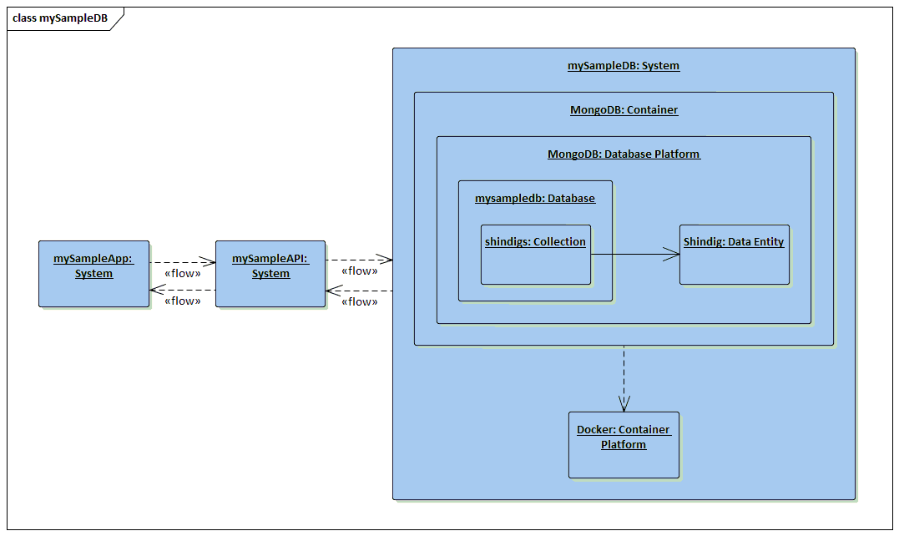

# mySampleDB

The thrid part of a three part app: The Datastore.

Designed to give me a <i>clean</i> system for explaining and applying security and
privacy principals, I created a simple app, API, and datastore where the
only security and privacy applied is that which is inherent in the frameworks, software,
and services that I'm using to build the system.

As I apply security and privacy, I will branch this code and explain what's being done.

For more info on this effort check out my blog: <a href="http://jburer.wordpress.com" target="_blank">http://jburer.wordpress.com</a>

## The Datastore

The <code>mysampledb</code> database is a JSON document inside MongoDB. It's loaded with data
into the <code>shindigs</code> collection when composed from
<code>./data/db.json</code>.

The database is exposed on port <code>:27017</code>.

The corresponding <i>API</i> is here: <a href="https://github.com/jburer/mysampleapi" target="_blank">https://github.com/jburer/mysampleapi</a>.

The corresponding <i>app</i> is here: <a href="https://github.com/jburer/mysampleapp" target="_blank">https://github.com/jburer/mysampleapp</a>.

## Architecture

This is pretty straightforward DB setup that sits independently from the API and app.



It is designed to be run inside a Docker container.

## Docker Setup

Clone the repository and move to the <code>mysampledb</code> directory.

```
docker-compose up -d
```

This will make the datastore available at the following URI:

```
mongodb://localhost:27017
```
