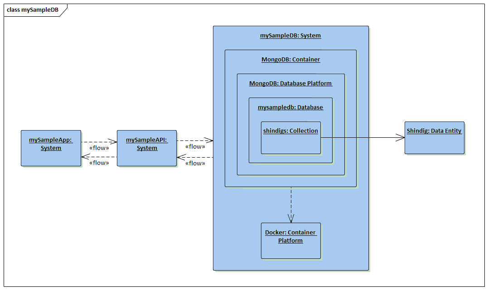

# mySampleDB

The thrid part of a three part app: The Datastore.

Designed to give me a system for explaining and applying security and
privacy principals, I created a simple app, API, and datastore.

The only security and privacy applied is that which is inherent in the frameworks, software,
and services that I'm using to build the system.

As I apply security and privacy, I will branch this code and explain what's being done.

For more info on this effort check out my blog: <a href="http://jburer.wordpress.com" target="_blank">http://jburer.wordpress.com</a>

## The Datastore

The <code>mysampledb</code> database is a JSON document inside MongoDB. It's loaded from
the <code>db.json</code> file and into the <code>shindigs</code> collection when composed.

The corresponding API is here: <a href="https://github.com/jburer/mysampleapi" target="_blank">https://github.com/jburer/mysampleapi</a>.  
<i>NOTE: This app is hardcoded to look for the API on port 3000</i>

The corresponding app is here: <a href="https://github.com/jburer/nistapi" target="_blank">https://github.com/jburer/nistapi</a>.  
<i>NOTE: This app is hardcoded to look for the API on port 3000</i>

## Architecture

This is pretty straightforward Vue app that points to the required API.



It is designed to be run inside a Docker container, but can be run as a node app as well.

## Docker setup

Clone the repository and move to the <code>mysampledb</code> directory.

```
docker build -t <whatever>/nistapp .
docker run -d -p 8080:80 --name nistapp <whatever>/nistapp
```

This will make the app available on

```
http://localhost:8080
```
